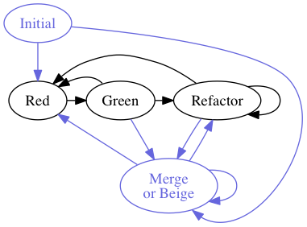

TDD/BDD Commit
==============

Helps you stick to the "red-green-refactor" (and more) pattern of commits when using [test-driven development](http://en.wikipedia.org/wiki/Test-driven_development) or [behaviour-driven development](http://en.wikipedia.org/wiki/Behavior-driven_development).

Instead of using `git commit ...`, you'd issue `commit red`, `commit green`, and so on. You'll be asked for a commit message if one's needed, and `git` will be called to make the commit. Message length limits and quotes inside the messages are handled.

(The central "red-green-refactor" cycle is depicted \[in black\], with the additional commit types around the outside \[in slate blue\].)

Background
----------

In [test-driven development](http://en.wikipedia.org/wiki/Test-driven_development) and [behaviour-driven development](http://en.wikipedia.org/wiki/Behavior-driven_development) there are three main types of commits:

-   "red" after a failing test/part-test;
-   "green" when that test/part passes, and
-   "refactor" when changes are made to improve the code's quality along the lines of [DRY](http://en.wikipedia.org/wiki/Don't_repeat_yourself), the [single responsibility principle](http://en.wikipedia.org/wiki/Single_responsibility_principle) and other such guidelines.

Commits should alternate between "red" and "green", with optional (though highly-recommended) refactorings after a "green" commit. It helps, particularly when performing a test-/behaviour-driven development kata, for the commit messages to tell a story (and, for katas, to be only one line, so they can be quickly read). This tool makes it easy to format them into sentences.

**Note:** "green" commits do not need messages, as their purpose should be clear from the preceding "red" commit.

There are three additional types of commit (one is only used once per project):

-   "initial" is the first commit;
-   "merge" commits are used when bringing in commits from other branches or repositories, and
-   "beige" commits affect parts of the project that are outside the remit of TDD, such as (some) documentation and static assets---do think carefully whether a green--red pattern would be more suitable, though!

You will always have an initial commit, and may well use merge commits. Initial commits do not need messages. Merges can be carried out after green or refactor commits.

There was some interesting information in this [StackOverflow question and answers on git commit message formatting](http://stackoverflow.com/questions/2290016/git-commit-messages-50-72-formatting).

Commit Messages
---------------

**Note:** this is not actually implemented yet ;-).

There are two ways to specify commit messages...

-   Specify a header line whilst using the `commit` command; this should briefly explain the main purpose of the changes in the commit.
-   You can also give a body to the commit message, containing more details. This can be done by including the body information in a `CHANGES` file in the root of the repository.
    -   The contents of this file are treated as the body (a good format for this file would be an asterisk-bulleted list with no leading linespace). **Note that lines are not auto-wrapped.**
    -   The file is emptied after a successful commit, so you can start again.

### Example CHANGES file

    * Fix recurring issue with the chameleon circuit
    * Add extra stabilisation routine to flux capacitor

Development Environment Set-up
------------------------------

### First-time Setup

If you haven't got them, get **pip** and **virtualenv**

-   `sudo easy_install pip`
-   `pip install virtualenv`

Create and activate the virtual environment

-   `virtualenv .venv`
-   `. .venv/bin/activate`

Install/update packages

-   `pip install -r requirements.txt`
-   or `pip install --upgrade -r requirements.txt`

### Day-to-day Development

Activate the virtual environment and set the path for testing

-   `. .venv/bin/activate`
-   `export PYTHONPATH=.`

**Note:** if you have [autoenv](https://github.com/kennethreitz/autoenv), the virtualenv script will be automatically sourced when you enter the directory.

The tests can be run continuously with `py.test --looponfail tests` or `py.test -f tests`.
